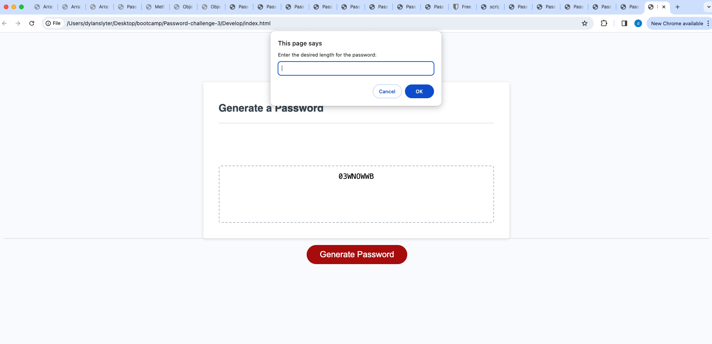

Challenge 3

Creating a random password generator

Description

Using javascript and html to create a random generatory for a password.
N/A

Usage

Asking you questions to decide on what you want in your passsword and the length of it

Credits

N/A

License

Please refer to the LICENSE in the repo.

🏆 The previous sections are the bare minimum, and your project will ultimately determine the content of this document. You might also want to consider adding the following sections.

Badges

Features

If your project has a lot of features, list them here.

How to Contribute

If you created an application or package and would like other developers to contribute to it, you can include guidelines for how to do so. The Contributor Covenant is an industry standard, but you can always write your own if you'd prefer.

